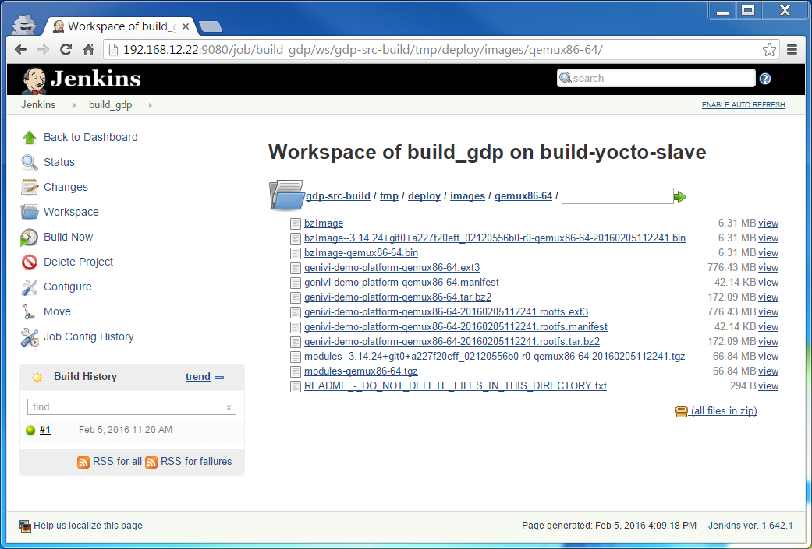

## Introduction

<!-- (2016-02-02 07:58 CET) -->

This document explains how to build from sources my fork of the [GENIVI Demo Platform](http://projects.genivi.org/genivi-demo-platform/home) using Jenkins.

This procedure may be used as a regression test suite for the [gmacario/easy-jenkins](https://github.com/gmacario/easy-jenkins) project.

The following instructions were tested on

* Docker client: itm-gmacario-w7 (MS Windows 7 64-bit, Docker Toolbox 1.10.0)
* Docker engine: mv-linux-powerhorse (Ubuntu 14.04.3 LTS 64-bit, Docker Engine 1.10.0)

## Preparation

On a bash shell on the Docker Client, deploy master branch of [gmacario/easy-jenkins](https://github.com/gmacario/easy-jenkins) to docker-machine `mv-linux-powerhorse`

```
$ git clone https://github.com/gmacario/easy-jenkins
$ cd ~/easy-jenkins
$ eval $(docker-machine env mv-linux-powerhorse)
$ docker-compose stop; docker-compose rm -f; docker-compose build --pull
$ ./runme.sh
```

Some information messages should be displayed on the launching terminal:

```
gmacario@ITM-GMACARIO-W7 MINGW64 ~/easy-jenkins (master)
$ ./runme.sh
INFO: Docker machine mv-linux-powerhorse exists, skipping docker-machine create
INFO: Using Docker machine mv-linux-powerhorse
Creating easyjenkins_myjenkins_1
Creating easyjenkins_build-yocto-slave_1
INFO: Browse http://192.168.12.22:9080/ to access the Jenkins dashboard
INFO: Run the following command to configure your shell:
INFO: eval $(docker-machine env mv-linux-powerhorse)

gmacario@ITM-GMACARIO-W7 MINGW64 ~/easy-jenkins (master)
$
```

Take note of the `${JENKINS_URL}` (in our example, <http://192.168.12.22:9080/>) where the Jenkins dashboard could be accessed.

(Optional) Watch docker-compose logs until line `INFO: Jenkins is fully up and running` is displayed:

```
$ docker-compose logs
...
myjenkins_1         | INFO: Completed initialization
myjenkins_1         | Feb 02, 2016 7:05:31 AM hudson.WebAppMain$3 run
myjenkins_1         | INFO: Jenkins is fully up and running
...
```

Browse `${JENKINS_URL}` as explained by the `INFO: Browse xxx to access the Jenkins dashboard` message above and verify that the Jenkins dashboard is displayed correctly.

#### Build project `seed`

Browse `${JENKINS_URL}/job/seed`, then click **Build Now**

Result: The following items will be generated and show up in the Jenkins dashboard:

1. add_jenkins_slave
2. build_gdp
3. configure_git

#### Configure git on Jenkins node `master`

<!-- (2016-02-04 12:16 CET) -->

Workaround for [issues/26](https://github.com/gmacario/easy-jenkins/issues/26)

Browse `${JENKINS_URL}/job/configure_git/`, then click **Build Now**

Verify in the Console Output that the job was run on the master node (at this point there should not be any slave nodes yet)

#### Create Jenkins node `build-yocto-slave`

<!-- (2016-02-04 12:17 CET) -->

Workaround for [issues/16](https://github.com/gmacario/easy-jenkins/issues/16)

Browse `${JENKINS_URL}/job/add_jenkins_slave/` then click **Build with Parameters**

- AgentList: `build-yocto-slave`
- AgentDescription: `Auto-created Jenkins agent`
- AgentExecutors: `2`
- AgentHome: `/home/jenkins`
- AgentLabels: `yocto`

then click **Build**

Browse `${JENKINS_URL}`, verify that node `build-yocto-slave` is running.

#### Configure git on Jenkins node `build-yocto-slave`

<!-- (2016-02-04 12:19 CET) -->

Workaround for [issues/27](https://github.com/gmacario/easy-jenkins/issues/27)

Browse `${JENKINS_URL}/job/configure_git/`, then click **Configure**

- Restrict where this project can be run: Yes
  - Label Expression: `build-yocto-slave`

Click **Save**, then click **Build Now**

Verify in the Console Output that the job was run on the slave.

## Build project `build_gdp`

<!-- (2016-02-04 12:20 CET) -->

Browse `${JENKINS_URL}/job/build_gdp/`, then click **Build Now**

You may watch the build logs at `${JENKINS_URL}/job/build_gdp/lastBuild/console`

<!-- (2016-02-04 17:06 CET) -->

```
Started by user anonymous
[EnvInject] - Loading node environment variables.
Building remotely on build-yocto-slave (yocto) in workspace /home/jenkins/workspace/build_gdp
Cloning the remote Git repository
Cloning repository https://github.com/gmacario/genivi-demo-platform
...
NOTE: Running task 4393 of 4394 (ID: 7, /home/jenkins/workspace/build_gdp/gdp-src-build/../meta-genivi-demo/recipes-demo-platform/images/genivi-demo-platform.bb, do_rootfs)
NOTE: recipe genivi-demo-platform-1.3+snapshot-20160205-r0: task do_rootfs: Started
NOTE: recipe genivi-demo-platform-1.3+snapshot-20160205-r0: task do_rootfs: Succeeded
NOTE: Running noexec task 4394 of 4394 (ID: 11, /home/jenkins/workspace/build_gdp/gdp-src-build/../meta-genivi-demo/recipes-demo-platform/images/genivi-demo-platform.bb, do_build)
NOTE: Tasks Summary: Attempted 4394 tasks of which 22 didn't need to be rerun and all succeeded.

Summary: There were 16 WARNING messages shown.
Notifying upstream projects of job completion
Finished: SUCCESS
```

**NOTE**: A full build takes about 5 hours to complete on a dual-Xeon(R) CPU X5450 @3.00 GHz and 16 GB RAM.

Browse `${JENKINS_URL}/job/build_gdp/ws/gdp-src-build/tmp/deploy/images/qemux86-64/` to inspect the build results.



<!-- EOF -->
